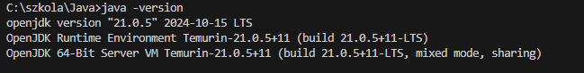
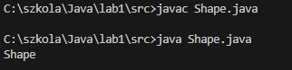
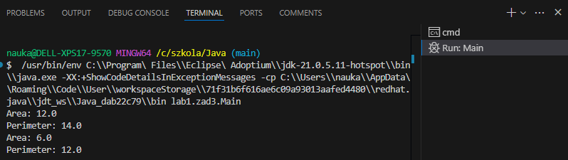

# Zad 1


# Zad 2
```
package lab1.src;


public class Shape {
   public void print() {
      System.out.println(this.getClass().getSimpleName());
   }


   public static void main(String[] args) {
      Shape shape = new Shape();
      shape.print();
   }
}

class Main {
   public static void main(String[] args) {
      Shape shape = new Shape();
      shape.print();
   }
}
```


# Zad 3

```
package lab1.zad3;

abstract class Shape{
   public void print(){
      System.out.println(this.getClass().getSimpleName());
   }

   public abstract double getArea();
   public abstract double getPerimeter();
}

class Rectangle extends Shape{
   private double width;
   private double height;

   public Rectangle(double width, double height){
      this.width = width;
      this.height = height;
   }

   public double getPerimeter(){
      return 2 * (width + height);
   }

   public double getArea(){
      return width * height;
   }
}

class Triangle extends Shape{
   private double a, b, c;

   public Triangle(double a, double b, double c){
      this.a = a;
      this.b = b;
      this.c = c;
   }

   public double getPerimeter(){
      return a + b + c;
   }

   public double getArea(){
      double p = getPerimeter() / 2;
      return Math.sqrt(p * (p - a) * (p - b) * (p - c));
   }
}

class ShapeDescriber {
   public static void describe(Shape shape){
      System.out.println("Area: " + shape.getArea());
      System.out.println("Perimeter: " + shape.getPerimeter());
   }
}

class Main {
   public static void main(String[] args) {
      Shape rectangle = new Rectangle(3, 4);
      Shape triangle = new Triangle(3, 4, 5);

      ShapeDescriber.describe(rectangle);
      ShapeDescriber.describe(triangle);
   }
}
```


