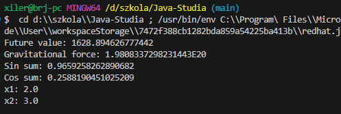

# Rozwiązanie:

### Przyszła wartość inwestycji

```java
   public static double futureValue(double p, double r, double n){
      return p * Math.pow(1+r, n);
   }
```

### Przyciąganie grawitacyjne

```java
   public static double gravitationalForce(double m1, double m2, double r){
      return G * (m1 * m2) / Math.pow(r,2);
   }
```

### Suma sinusów

```java
   public static double sinSum(double x, double y){
      return Math.sin(x) * Math.cos(y) + Math.cos(x) * Math.sin(y);
   }
```

### Suma cosinusów

```java
   public static double cosSum(double x, double y){
      return Math.cos(x) * Math.cos(y) - Math.sin(x) * Math.sin(y);
   }
```

### Rozwiązanie równania kwadratowego

```java
   public static double[] quadraticEquation(double a, double b, double c){
      double delta = Math.pow(b,2) - 4 * a * c;
      if(delta < 0) return null;

      double x1 = (-b - Math.sqrt(delta)) / (2 * a);
      double x2 = (-b + Math.sqrt(delta)) / (2 * a);

      return new double[]{x1, x2};
   }
```

### Main:

```java
   public static void main(String[] args) {
      // Przyszła wartość inwestycji
      double p = 1000;
      double r = 0.05;
      int n = 10;
      System.out.println("Future value: " + futureValue(p, r, n));

      // Przyciąganie grawitacyjne
      double m1 = 5.972e24;
      double m2 = 7.348e22;
      double distance = 3.844 * Math.pow(10, 8);
      System.out.println("Gravitational force: " + gravitationalForce(m1, m2, distance));

      // Tożsamości trygonometryczne
      double x = Math.toRadians(30);
      double y = Math.toRadians(45);
      System.out.println("Sin sum: " + sinSum(x, y) + " = " + Math.toDegrees(x + y));
      System.out.println("Cos sum: " + cosSum(x, y) + " = " + Math.toDegrees(x + y));

      // Pierwiastki równania kwadratowego
      double a = 1;
      double b = -5;
      double c = 6;
      double[] result = quadraticEquation(a, b, c);
      if (result != null) {
         System.out.println("x1: " + result[0]);
         System.out.println("x2: " + result[1]);
      } else {
         System.out.println("No solution");
      }
   }
```

# Wyniki


